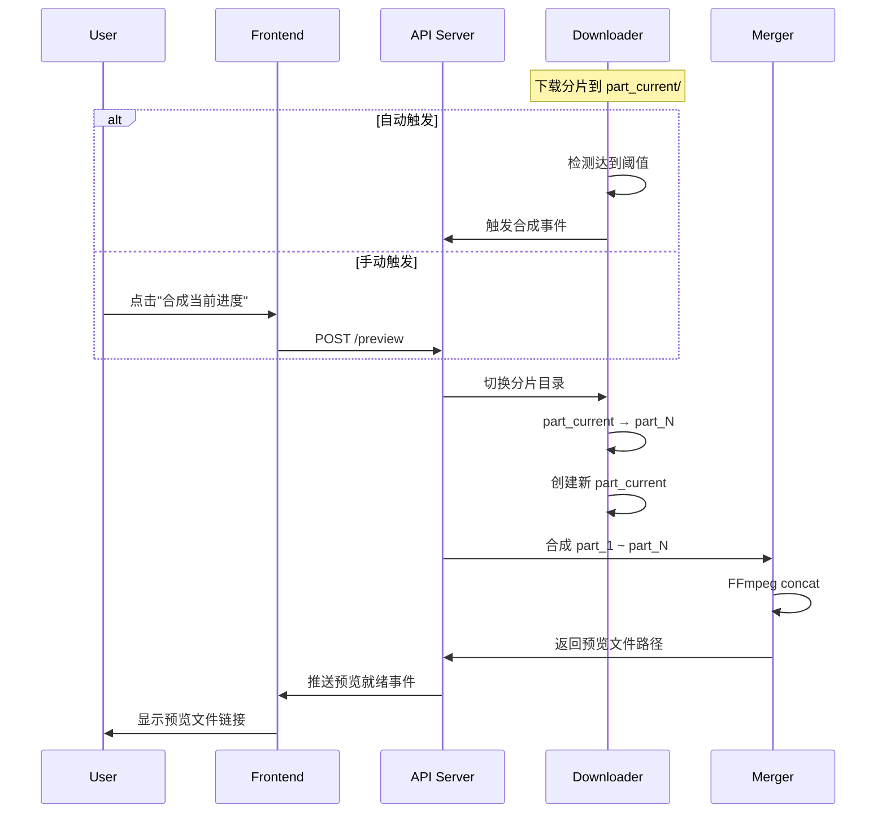

# 分段合成功能设计文档

> 创建日期: 2026-02-22

## 1. 功能概述

在 M3U8 视频下载过程中，支持手动或自动触发合成已下载的分片，生成可播放的预览视频。

### 使用场景

1. **边下边看**: 下载一部分后立即可以预览播放，不用等全部下载完成
2. **部分保存**: 如果下载中断，已下载的部分不会丢失，可以保留成独立视频
3. **快速分享**: 下载一部分后可以先分享给他人观看，后续继续下载完整版

## 2. 核心机制

### 2.1 分片管理策略

```
临时目录结构：
.temp_segments_{id}/
├── chunks/
│   ├── part_001/
│   │   ├── seg_000001.ts
│   │   ├── seg_000002.ts
│   │   └── ...
│   ├── part_002/
│   │   └── ...
│   └── part_current/     ← 当前正在写入的分片目录
├── previews/
│   ├── preview_001.mp4   ← 自动/手动合成的预览文件
│   ├── preview_002.mp4
│   └── preview_latest.mp4 ← 最新的预览文件（软链接或复制）
└── segments.txt          ← 索引文件
```

### 2.2 自动合成触发条件

用户可配置：
- **按百分比**: 每 25% / 33% / 50% 合成一次
- **按分片数**: 每 50 / 100 / 200 个分片合成一次
- **关闭自动**: 仅手动触发

### 2.3 手动触发机制

界面显示"合成当前进度"按钮，点击后：
1. 将当前分片目录标记为 `part_N`
2. 创建新的 `part_current` 目录继续下载
3. 合成 `part_1` 到 `part_N` 的所有分片
4. 生成预览文件

### 2.4 合成时的下载行为

合成时**继续下载**，不暂停。通过分片目录切换实现并发：
- 合成进程读取已完成的分片目录
- 下载进程写入新的分片目录
- 互不阻塞

### 2.5 预览文件处理

用户可选择：
- **临时预览**: 生成临时预览文件供播放，下载完成后删除临时文件，只保留最终完整版
- **独立保存**: 生成独立的 `preview_001.mp4` 文件，永久保留

## 3. API 设计

### 3.1 新增端点

| 端点 | 方法 | 功能 |
|------|------|------|
| `/api/download/:id/preview` | POST | 手动触发合成预览 |
| `/api/download/:id/preview` | GET | 获取预览文件列表 |
| `/api/download/:id/preview/latest` | GET | 获取最新预览文件路径 |

### 3.2 请求/响应示例

```typescript
// POST /api/download/:id/preview
{
  "mode": "temporary" | "keep"  // 临时预览 或 独立保存
}

// 响应
{
  "success": true,
  "previewFile": "/path/to/preview_001.mp4",
  "segments": 50,
  "duration": "5:30"
}

// GET /api/download/:id/preview
{
  "previews": [
    { "file": "preview_001.mp4", "segments": 50, "createdAt": "2026-02-22T10:00:00Z" },
    { "file": "preview_002.mp4", "segments": 100, "createdAt": "2026-02-22T10:05:00Z" }
  ]
}
```

### 3.3 启动下载时新增参数

```typescript
// POST /api/download/start
{
  "url": "https://example.com/video.m3u8",
  "outputPath": "/path/to/output.mp4",
  "previewConfig": {
    "autoMerge": true,           // 是否自动合成
    "triggerMode": "percentage", // "percentage" | "segments" | "disabled"
    "triggerValue": 25,          // 百分比或分片数
    "fileMode": "ask"            // "temporary" | "keep" | "ask"
  }
}
```

## 4. 界面设计

### 4.1 下载任务卡片

```
┌─────────────────────────────────────────────────────┐
│ 📹 video_title.mp4                                  │
│ ████████████░░░░░░░░░ 40%  (80/200 segments)        │
│                                                     │
│ [▶ 合成当前进度] [⏸ 暂停] [✕ 取消]                  │
│                                                     │
│ 📎 预览文件: preview_001.mp4 (5:30) [打开]          │
└─────────────────────────────────────────────────────┘
```

### 4.2 设置面板

```
分段合成设置：
┌─────────────────────────────────────────────────────┐
│ 自动合成: [开启 ▼]                                  │
│   触发条件: [每 25% ▼]                              │
│                                                     │
│ 预览文件处理: [询问 ▼]                              │
│   选项: 询问 / 临时预览 / 独立保存                   │
└─────────────────────────────────────────────────────┘
```

## 5. 数据流



## 6. 实现范围

### 6.1 需要修改的模块

| 模块 | 文件 | 修改内容 |
|------|------|----------|
| **m3u8-dl** | `downloader.ts` | 分片目录管理、自动合成检测 |
| **m3u8-dl** | `merger.ts` | 增量合并逻辑 |
| **m3u8-dl** | `server.ts` | 新增预览相关 API |
| **m3u8-dl** | `types.ts` | 新增类型定义 |
| **desktop** | `App.tsx` | 下载卡片添加合成按钮 |
| **desktop** | `settings.ts` | 分段合成设置面板 |

### 6.2 不在范围内

- 断点续传（可作为后续功能）
- 浏览器插件的改动（暂不需要）

## 7. 风险与注意事项

1. **磁盘空间**: 预览文件会占用额外空间，需要提示用户
2. **合成性能**: 大量分片时 FFmpeg concat 可能耗时，建议在后台线程执行
3. **文件冲突**: 需要确保合成和下载不会同时操作同一个分片文件
